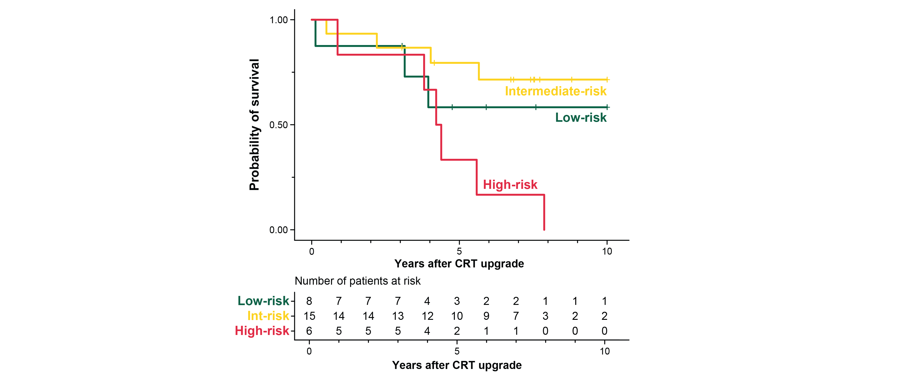

# ML-based risk stratification of patients undergoing CRT upgrade


The primary purpose of this repository is to enable the risk stratification of patients undergoing a cardiac resynchronization therapy (CRT) upgrade procedure using our machine-learning model described in the following paper:

> [**Phenogrouping patients undergoing cardiac resynchronization therapy upgrade using topological data analysis**](https://doi.org/10.1038/s41598-023-47092-x)<br/>
  Walter Richard Schwertner, Márton Tokodi, Boglárka Veres, Anett Behon, Eperke Dóra Merkel, Richárd Masszi, Luca Kuthi, Ádám Szijártó, Attila Kovács, István Osztheimer, Endre Zima, László Gellér, Béla Merkely, Annamária Kosztin, Dávid Becker<br/>
  <b>Scientific Reports</b> (2023)

In this study, we first applied topological data analysis to create a patient similarity network using 16 clinical features of 326 patients (without an implantable cardioverter-defibrillator or a history of ventricular arrhythmias) who underwent a CRT upgrade procedure. Then, in the generated circular topological network, we delineated three distinct groups (i.e., phenogroups) using community autogrouping (<b>Figure 1A</b>) that differed not only in their clinical characteristics but also showed differences in the risk of all-cause mortality (<b>Figure 1B</b>).


<div align="center"><i><b>Figure 1</b> (A) Patient similarity network created using topological data analysis and (B) the Kaplan-Meier curves depicting the survival of the three risk groups</i></div><br/>

Finally, we labeled the patients based on their location in the network (i.e., we assigned each patient to either the low-risk, intermediate-risk, or high-risk phenogroup, excluding those who belonged to multiple groups or were located in nodes outside of the loop) and used that labeled data (n=285) to train several different multi-class classifiers with nested cross-validation (with 5 folds in both the inner and outer loops). Among the evaluated multi-class classifiers, the ensemble of 5 multi-layer perceptrons exhibited the best performance with a balanced accuracy of 0.898 (95% confidence interval: 0.854 – 0.942) and a micro-averaged area under the receiver operating characteristic curve of 0.983 (95% confidence interval: 0.980 – 0.986). We also tested this model on an additional 29 patients from an external center. In this cohort, all patients who were predicted to belong to the high-risk phenogroup died within 10 years following the upgrade procedure (<b>Figure 2</b>). Nevertheless, differences between the survival of the three groups were less pronounced, which is most likely attributable to the small sample size.


<div align="center"><i><b>Figure 2</b> Kaplan-Meier curves depicting the survival of the three risk groups in the external dataset</i></div><br/>

Of note, this repository was forked from [szadam96/framework-for-binary-classification](https://github.com/szadam96/framework-for-binary-classification), which we have thoroughly described in this paper:
> [**A machine learning framework for performing binary classification on tabular biomedical data**](https://doi.org/10.1556/1647.2023.00109)<br/>
  Ádám Szijártó, Alexandra Fábián, Bálint Károly Lakatos, Máté Tolvaj, Béla Merkely, Attila Kovács, Márton Tokodi<br/>
  <b>IMAGING</b> (2023)

## Contents of the repository


  - `bio_data` - the collection of functions and classes used for preprocessing
  - `config_files` - the folder containing the configuration files used for training the models
  - `example_data` - the folder containing example data
  - `figs` - the folder containing the figures used in `README.md`
  - `model` - model classes
  - `trained_models` - the folder containing the trained model(s)
  - `utils` - the collection of functions required for the training and risk stratification scripts
  - `LICENSE.md` - the details of the license (Apache 2.0)
  - `README.md` - the brief explanation of the purpose and content of this repository
  - `main.py` - run this script to train a new model or perform risk stratification
  - `requirements.txt` - the list of the required Python packages
  - `risk_stratification.py` - the scripts required for risk stratifying new patients using the trained model
  - `training.py` - the scripts required for training a new multi-class classifier

## Installation


  1) Clone the repository
  2) Create a virtual environment in Python (version 3.9.13) and activate it
  3) Install the required Python packages (listed in `requirements.txt`) in the virtual environment

## Usage


### Risk stratifying new patients using the trained model

To risk stratify new patients using our model (i.e., an ensemble of 5 multi-layer perceptrons) described in the above-referenced [paper](https://www.nature.com/srep/), you should run the following command:

```
python main.py risk_stratify --data PATH_TO_CSV_FILE_WITH_DATA --target_folder PATH_TO_TARGET_FOLDER --model_path PATH_TO_TRAINED_MODEL
```

```PATH_TO_CSV_FILE_WITH_DATA``` is the path to the CSV file containing the data of new patients, ```PATH_TO_TARGET_FOLDER``` is the path to the folder where the prediction results will be saved, and ```PATH_TO_TRAINED_MODEL``` is the path to the trained model. The trained model (`trained_models/mlp/model.pkl`), as well as a CSV file containing the data of three example patients (`example_data/example_data_for_risk_stratification.csv`), are also provided in the repository. You should use the provided template (`example_data/template.csv`) without changing the order and names of the columns. Additional information on the columns (i.e., input features) can be found below.

Dictionary of input features:
  1) `age`: age at the CRT upgrade procedure (years)
  2) `sex`: sex of the patient (0 - male, 1 - female)
  3) `crt_d`: type of the implanted device (0 - CRT-P, 1 - CRT-D)
  4) `nyha`: NYHA functional class prior to the upgrade procedure (1 - I, 2 - II, 3 - III, 4 - IV)
  5) `afib`: history of atrial fibrillation (0 - no, 1 - yes)
  6) `htn`: hypertension (0 - no, 1 - yes)
  7) `diabetes`: diabetes mellitus (0 - no, 1 - yes)
  8) `etiology`: etiology of heart failure (0 - non-ischemic, 1 - ischemic)
  9) `mi`: history of myocardial infarction (0 - no, 1 - yes)
  10) `pci`: history of percutaneous coronary intervention (0 - no, 1 - yes)
  11) `cabg`: history of coronary artery bypass graft surgery (0 - no, 1 - yes)
  12) `creat`: serum creatinine (µmol/L)
  13) `gfr`: glomerular filtration rate calculated based on the MDRD formula (mL/min/1.73 m<sup>2</sup>)
  14) `lvef`: left ventricular ejection fraction measured using echocardiography (%)
  15) `lvidd`: left ventricular internal diameter at end-diastole measured using echocardiography (mm)
  16) `lvids`: left ventricular internal diameter at end-systole measured using echocardiography (mm)

### Training a new model for multi-class classification

This repository also contains the scripts that we used for training our models. If you want to train a new model for a multi-class classification task, you should run the following command:

```
python main.py train --data PATH_TO_CSV_FILE_WITH_DATA --config_path PATH_TO_CONFIG_FILE --target_folder PATH_TO_TARGET_FOLDER
```

```PATH_TO_CSV_FILE_WITH_DATA``` is the path to the CSV file containing the data of new patients, ```PATH_TO_CONFIG_FILE```
is the path to the file containing the training configurations, ```PATH_TO_TARGET_FOLDER``` is the path to the folder where the prediction results will be saved. Configuration files that we used in our experiments can be found in the `config_files` folder.

For further information on the usage of our codes, please run the following command: <br>
```
python main.py --help
```

## Contact


For inquiries related to the content of this repository, contact Márton Tokodi, M.D., Ph.D. (tok<!--
-->mar<!--
-->ton[at]gmail.co<!--
-->m).
